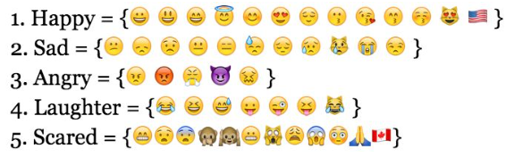

## Jallikattu Twitter Analysis
Try to understand the overall sentiment of people during the Jallikattu protest.

### Inspiration
- [Analyzing Twitter Sentiment of the 2016 Presidential Candidates Paper by Stanford students](http://web.stanford.edu/~jesszhao/files/twitterSentiment.pdf)
- [Watching the US Federal Election through Twitter](https://goodfoodgoodcode.com/2016/11/14/watching-the-us-federal-election-through-twitter/)

#### Interesting Points
1) Stanford paper shows how they catapulted the data gathering process by segregating Tweets by smileys used. They based the categorization on,

2) Normalizing text has a few other steps when considering Tweets,

We converted all of our text to lowercase, removed hashtags before words, and removed extra spaces in the text. Since Twitter is very casual, people often include multiples of the same letters in a word, such as “sooooo funnnyyy.” To handle these cases, we replaced more than two of the same consecutive letters with just two of that letter. We also ignored all URLs and usernames since URLs and usernames don’t typically relate to the emotion expressed in the tweet. Furthermore, we found a list of common words that do not express sentiment (Janardhana). The list includes words like “be,” “at,” “the,” etc. All words in a training tweet found on this list were ignored and not added to the feature vector with a weight.

3) Algorithm Comparison
Naive Bayes, SVM and Nearest Neighbor were the top performing. SVM was a shy ahead of NB in most cases.

### Pre Requisites
- Only Twitter data is considered.
- Consider only Tweets from Jan 7th, 2017 to Jan 21st, 2017.
- Only "#jallikattu, OR #jallikattubill, OR #ammendpca" hashtags are considered for the first roll of data aggregation. We then need to create a self expanding hashtag graph to find more relevant hashtags and run the data aggregator again.

### Data split
- 3000 Tweets will be considered.
- 500 Tweets will be used to train the analyzer to accurately predict sentiment.
- 500 Tweets will be test data.
- 2000 Tweets will be validation data.

### Analysis Coverage
- Day by Day Sentiment Analysis
- Sentiment difference between tweets containing Jallikattu and Peta as major terms
- National news media coverage frequency and top media article summary and sentiment
- Word cloud
